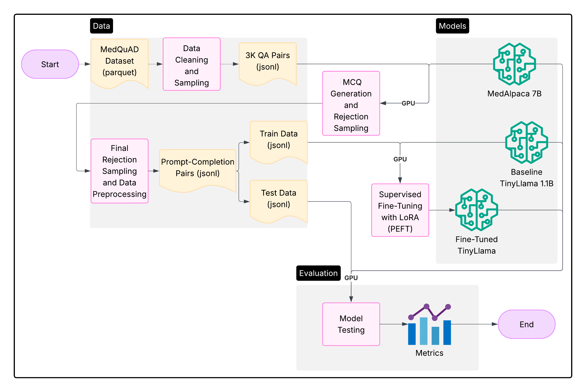

# Rejection Sampling for Medical MCQ Generation and Fine-Tuning TinyLlaMA for Layperson QA

## Notebooks
- [01-sample-data.ipynb](01-sample-data.ipynb)
- [02-generate-mcqs.ipynb](02-generate-mcqs.ipynb)
- [03-finetune-model.ipynb](03-finetune-model.ipynb)
- [04-evaluate-models.ipynb](04-evaluate-models.ipynb)
- [05-plot-results.ipynb](05-plot-results.ipynb)

## Data
[huggingface.co/datasets/lavita/MedQuAD](https://huggingface.co/datasets/lavita/MedQuAD)
